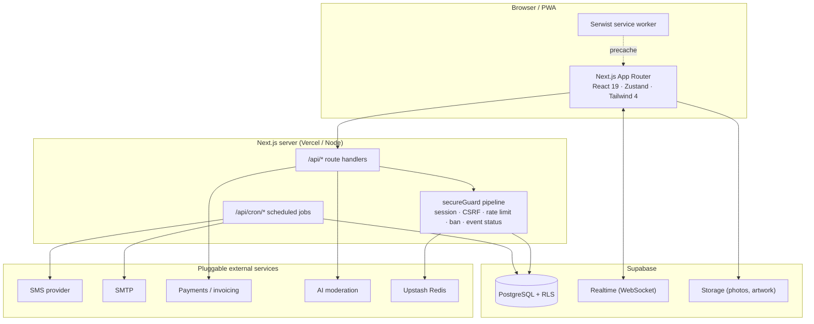

<div align="center">

# Eventa

**Turn any live event into a social experience.**

A production-grade, mobile-first PWA that gives guests at a wedding, party or
meetup a private, event-scoped social layer — scan a QR code, build a profile in
under a minute, browse other guests, match, and chat in real time. No app store,
no account, no data left behind.

[](../../actions/workflows/ci.yml)
[](../../actions/workflows/security.yml)
[](../../actions/workflows/codeql.yml)
[](LICENSE)

Next.js 16 · React 19 · TypeScript · Supabase · Tailwind CSS 4

</div>

---

> ## ⚠️ Read first — this is a personal project, published to be read, not used
>
> This is a **personal side project**. I built it for myself, I ran it myself,
> and I have since shut it down. It is published here **purely as a portfolio
> and reference artefact so the code can be read**.
>
> - **It is not open-source software.** No licence to use it is granted to
>   anyone. You may not use, copy, modify, deploy, host, sell or build on this
>   project or any part of it. See [LICENSE](LICENSE) — **all rights reserved**.
> - **It is not a product, a template or a starter kit.** It is not maintained,
>   not supported, and issues and pull requests are not accepted.
> - **It comes with no warranty of any kind and I accept no responsibility or
>   liability whatsoever** for anything anyone does with it, or for any
>   consequence of reading, copying or running it.
> - **The legal documents inside are templates, not legal advice.** The terms,
>   privacy policy, cookie policy, accessibility statement and customer
>   agreement were written for my own former use in one jurisdiction. They are
>   not accurate or compliant for anybody else and must not be relied upon.
>
> The setup and configuration sections below document **how I built and ran my
> own deployment**. They are here to explain the engineering, not to invite or
> authorise anyone else to run it.

---

## Table of contents

1. [What this is](#what-this-is)
2. [Feature tour](#feature-tour)
3. [Architecture at a glance](#architecture-at-a-glance)
4. [Tech stack](#tech-stack)
5. [Running it locally](#running-it-locally)
6. [Configuration model](#configuration-model)
7. [External services](#external-services)
8. [Database & migrations](#database--migrations)
9. [Project structure](#project-structure)
10. [Testing](#testing)
11. [How it was deployed](#how-it-was-deployed)
12. [Security model](#security-model)
13. [Privacy & data retention](#privacy--data-retention)
14. [Localization & RTL](#localization--rtl)
15. [**Licence, disclaimer & liability**](#licence-disclaimer--liability)

---

## What this is

Eventa is a complete SaaS product — not a demo. It contains the guest app, the
organizer purchase funnel, the payment/invoicing integration, an admin
back-office with live analytics and AI content moderation, a messaging pipeline
(SMS + e-mail), scheduled cron jobs, and an automated privacy-driven
data-deletion lifecycle.

Every guest session is **scoped to a single event**. Participants can only ever
see other participants of the same event, and a week after the event ends every
piece of personal data is deleted automatically, leaving only anonymous
aggregate analytics behind.

It was built and operated as a Hebrew (RTL) service for the Israeli market, and
has since been taken offline. Every operator-specific value — domain, contact
details, legal entity, analytics IDs and all credentials — has been removed and
replaced with environment-driven placeholders, so nothing in this repository
points at any live system.

I published it because I am proud of the engineering, and I would rather it be
readable than sit in a private repository. Please read
[Licence, disclaimer & liability](#licence-disclaimer--liability) before doing
anything with it.

---

## Feature tour

### For guests (mobile web, no install)

| | |
|---|---|
| **QR join** | Scan a printed poster or open a link. Device fingerprinting + a join code gate entry to the event. |
| **Phone verification** | 6-digit OTP over SMS, with per-phone, per-IP and global anti-SMS-pumping limits. Can be switched off for local dev. |
| **Sub-minute onboarding** | Photo upload with client-side WebP compression and touch cropping, plus name, age, gender, preference, city and bio. |
| **Discovery grid** | Virtualized, paginated grid of other attendees filtered by mutual preference. |
| **Likes & matches** | Mutual likes open a conversation and trigger a full-screen match celebration. |
| **Real-time chat** | Supabase Realtime with an offline outbox, optimistic sends and a polling fallback for flaky venue Wi-Fi. |
| **Safety** | Block, report, AI photo moderation, admin bans enforced on a 60-second heartbeat, hardware fingerprint blocklists. |
| **Install as PWA** | Serwist service worker, offline shell, add-to-home-screen. |
| **Post-event feedback** | Short survey, plus an optional success-story submission. |

### For organizers

- Public marketing site (landing, pricing, how-it-works, FAQ) with full SEO metadata, JSON-LD and a generated sitemap.
- Multi-step order wizard: event type → details → background artwork → poster template → guest messaging → summary.
- Checkout through an invoicing/payment provider, with webhook reconciliation and a nightly payment-reconciliation cron.
- Automatically generated printable A4 QR poster, e-mailed on approval.
- Client portal for uploading a guest phone list (XLSX/CSV) behind an explicit, versioned consent gate.
- Automated lifecycle e-mails: upload reminders, payment confirmation, post-event summary report (optionally with an AI-written narrative).

### For the operator (admin console)

- Event CRUD and lifecycle control: draft → active → paused → ended → archived.
- Live per-event analytics: funnel conversion, engagement over time, demographics, network graph metrics, safety metrics, and reliability/drop-off detection.
- Global cross-event analytics and revenue view.
- Moderation queue with dual-model AI screening and a nightly re-check sweep.
- Messaging console for pre-event and feedback campaigns.
- Invoice and order-request management.
- Password + optional TOTP 2FA, with a persisted admin audit log.

---

## Architecture at a glance



**Key design decisions**

- **One guard, one place.** Every authenticated API route runs through
  `secureGuard` in [src/lib/route-helpers.ts](src/lib/route-helpers.ts), which
  verifies the session JWT, checks CSRF/Origin, applies the rate limit tier,
  and short-circuits banned users and inactive events. Route handlers only
  contain business logic.
- **Anon key is read-only.** Row-Level Security scopes every table to a single
  event; all writes go through server routes holding the service-role key.
- **Realtime with a safety net.** A singleton realtime hub deduplicates
  subscriptions, auto-reconnects on resume, and silently degrades to polling.
- **Fail open on non-critical services.** Missing AI, SMS or Redis credentials
  degrade gracefully (stub / auto-approve / in-memory) instead of taking the app
  down. Missing *auth* secrets fail loudly.
- **Secrets are lazy.** `JWT_SECRET` is read through a getter so a build never
  crashes when runtime-only secrets are absent.

Full detail: [docs/ARCHITECTURE.md](docs/ARCHITECTURE.md).

---

## Tech stack

| Layer | Choice | Why |
|---|---|---|
| Framework | **Next.js 16** (App Router) | SSR marketing pages for SEO, route handlers as the API, one deployable unit |
| UI | **React 19**, **Tailwind CSS 4**, **Framer Motion** | Concurrent rendering, utility CSS, gesture-driven swipe/match animations |
| State | **Zustand** (10 stores) | Tiny, persistable, no provider tree |
| Forms & validation | **React Hook Form** + **Zod** | Uncontrolled inputs for mobile perf; one schema shared by client and server |
| Backend | **Supabase** (PostgreSQL 17, Realtime, Storage) | Managed Postgres with RLS, WebSocket subscriptions and object storage in one service |
| Auth | Hand-rolled **HMAC-SHA256 JWT** sessions | Guests are anonymous, event-scoped identities — not Supabase Auth users |
| PWA | **Serwist** | Precaching, offline shell, installability |
| Charts / export | **Recharts**, **xlsx**, **jsPDF** | Admin analytics and report generation |
| E-mail | **Nodemailer** | Any SMTP provider |
| Tests | **Vitest** + Testing Library, **Playwright** | 106 unit/integration files, 28 E2E specs |
| Quality gates | ESLint, `tsc --noEmit`, CodeQL, `npm audit`, bundle-size budget, RLS coverage check | All wired into GitHub Actions |

Node **>= 20** is required (see [.nvmrc](.nvmrc)).

---

## Running it locally

> Documented for completeness, so the architecture below makes sense in context.
> This describes how **I** ran the project on my own machine. It is a record of
> my setup, not permission for anyone else to run it — see
> [LICENSE](LICENSE).

```bash
# 1. Install dependencies
npm install

# 2. Create the local environment file
cp .env.example .env.local

# 3. Generate the secrets the app needs
node -e "console.log('JWT_SECRET=' + require('crypto').randomBytes(48).toString('base64url'))"
node -e "console.log('CRON_SECRET=' + require('crypto').randomBytes(32).toString('base64url'))"
node -e "console.log('FIELD_ENCRYPTION_KEY=' + require('crypto').randomBytes(32).toString('base64'))"
node -e "console.log('BLIND_INDEX_KEY=' + require('crypto').randomBytes(32).toString('base64'))"
# paste the output into .env.local

# 4. Start a local Supabase stack (requires the Supabase CLI + Docker)
supabase start
supabase status            # copy API URL + anon key + service_role key into .env.local

# 5. Apply the schema, then every migration in order
psql "$DATABASE_URL" -f supabase/schema.sql
for f in supabase/migrations/*.sql; do psql "$DATABASE_URL" -f "$f"; done

# 6. Run it
npm run dev                # http://localhost:3000
```

**Minimum `.env.local` for local development** — everything else can stay blank,
and the corresponding feature stubs itself out:

```dotenv
NEXT_PUBLIC_SITE_URL=http://localhost:3000
NEXT_PUBLIC_SUPABASE_URL=http://127.0.0.1:54321
NEXT_PUBLIC_SUPABASE_ANON_KEY=<from supabase status>
SUPABASE_SERVICE_ROLE_KEY=<from supabase status>
JWT_SECRET=<48+ random bytes>
ADMIN_PASSWORD=<at least 12 characters>
CRON_SECRET=<32+ random bytes>

# Skip SMS verification so you can join events without a live SMS provider
NEXT_PUBLIC_PHONE_VERIFICATION_ENABLED=false
SMS_PROVIDER_LIVE=false
PAYMENT_PROVIDER_LIVE=false
```

Then visit:

| URL | What it is |
|---|---|
| `http://localhost:3000` | Marketing landing page |
| `http://localhost:3000/order` | Organizer order wizard |
| `http://localhost:3000/admin` | Admin console (log in with `ADMIN_PASSWORD`) |
| `http://localhost:3000/<event-slug>` | Guest app for a given event |

### Seed some demo data

```bash
node scripts/seed-demo-event.cjs    # demo event + 18 participants + likes/matches
node scripts/seed-fake-users.cjs    # adds 40 more participants (destructive)
```

Both read `.env.local` and require `SUPABASE_SERVICE_ROLE_KEY`. They are
destructive and are intended for a throwaway local database only.

### npm scripts

| Script | Purpose |
|---|---|
| `npm run dev` | Development server |
| `npm run build` | Production build + bundle budget check + service-worker path fix |
| `npm start` | Serve a production build |
| `npm run lint` | ESLint |
| `npm run typecheck` | `tsc --noEmit` |
| `npm test` | Vitest unit + integration, single run |
| `npm run test:watch` / `test:ui` | Vitest watch / UI |
| `npm run test:coverage` | V8 coverage report |
| `npm run test:e2e` | Playwright end-to-end suite |
| `npm run perf:budget` | Fail the build if bundles exceed the size budget |
| `npm run perf:regression` | Fail if bundles regressed against the committed baseline |
| `npm run check:rls` | Fail if any table is created without Row-Level Security |

---

## Configuration model

> ### 🚫 Not a setup guide
>
> This section documents **how the project was designed to be configured** —
> it is an architecture note, not an invitation to deploy it. Running this
> software is not permitted; see [LICENSE](LICENSE).

The repository contains **no credentials and no operator identity**. Every
brand-, domain-, contact- and legal-specific value is resolved in a single
module, **[src/config/site.ts](src/config/site.ts)**, from `NEXT_PUBLIC_*`
environment variables with neutral placeholder defaults. Nothing else under
`src/` hardcodes a domain, e-mail address, phone number, social profile or
company name.

The design goal was that rebranding the entire product — marketing site, legal
pages, transactional e-mail, SMS, QR/join links, SEO metadata, structured data
and the JWT issuer — should require editing exactly one file's worth of
environment variables, and that **any value left blank disappears from the UI
entirely** rather than rendering a dead link. Blank contact details remove the
footer social icons, the FAQ contact section, the legal-page contact blocks and
`security.txt`; a blank analytics ID means no tag is injected at all.

Every variable is documented inline in **[.env.example](.env.example)**. Summary:

| Group | Variables | Required? |
|---|---|---|
| **Branding & identity** | `NEXT_PUBLIC_SITE_URL`, `NEXT_PUBLIC_BRAND_NAME`, `NEXT_PUBLIC_BRAND_TAGLINE`, `NEXT_PUBLIC_BRAND_DESCRIPTION`, `NEXT_PUBLIC_CONTACT_EMAIL`, `NEXT_PUBLIC_CONTACT_PHONE`, `NEXT_PUBLIC_CONTACT_PHONE_DISPLAY`, `NEXT_PUBLIC_INSTAGRAM_URL`, `NEXT_PUBLIC_FACEBOOK_URL`, `NEXT_PUBLIC_LEGAL_ENTITY_NAME`, `NEXT_PUBLIC_LEGAL_ENTITY_FORM`, `NEXT_PUBLIC_ACCESSIBILITY_CONTACT_NAME` | `SITE_URL` required in production; rest optional |
| **Supabase** | `NEXT_PUBLIC_SUPABASE_URL`, `NEXT_PUBLIC_SUPABASE_ANON_KEY`, `SUPABASE_SERVICE_ROLE_KEY` | **Required** |
| **Auth & secrets** | `JWT_SECRET`, `ADMIN_PASSWORD`, `ADMIN_PASSWORD_HASH`, `ADMIN_TOTP_SECRET`, `ADMIN_AUDIT_PERSIST`, `CRON_SECRET`, `FIELD_ENCRYPTION_KEY`, `FIELD_ENCRYPTION_KEY_OLD`, `BLIND_INDEX_KEY`, `OTP_PEPPER`, `SECURITY_ALERT_WEBHOOK_URL` | `JWT_SECRET` required; `CRON_SECRET` required for cron |
| **Rate limiting** | `UPSTASH_REDIS_REST_URL`, `UPSTASH_REDIS_REST_TOKEN` | Optional (falls back to in-memory) |
| **E-mail** | `SMTP_HOST`, `SMTP_PORT`, `SMTP_USER`, `SMTP_PASS`, `SMTP_FROM`, `ADMIN_NOTIFICATION_EMAIL` | Optional |
| **SMS** | `SMS_PROVIDER_LIVE`, `TEXTME_API_TOKEN`, `TEXTME_USERNAME`, `TEXTME_SENDER_NAME` | Optional (stubbed) |
| **Payments** | `PAYMENT_PROVIDER_LIVE`, `INVOICE4U_API_TOKEN`, `INVOICE4U_API_URL` | Optional (stubbed) |
| **AI moderation** | `OPENAI_API_KEY`, `FALCONSAI_ENDPOINT`, `FALCONSAI_TOKEN` | Optional (fails open) |
| **Feature flags & tuning** | `NEXT_PUBLIC_PHONE_VERIFICATION_ENABLED`, `OTP_LENGTH`, `OTP_EXPIRY_SECONDS`, `OTP_MAX_ATTEMPTS`, `OTP_RESEND_COOLDOWN_SECONDS`, `OTP_MAX_PER_PHONE_PER_HOUR`, `OTP_GLOBAL_MAX_PER_DAY`, `LOG_LEVEL` | Optional |
| **Analytics** | `NEXT_PUBLIC_GOOGLE_ADS_ID`, `NEXT_PUBLIC_GA_MEASUREMENT_ID` | Optional |

Non-public tunables (cache TTLs, price, session lifetimes, messaging timings)
live in [src/lib/config.ts](src/lib/config.ts).

> **`NEXT_PUBLIC_*` variables are inlined into the browser bundle at build time.
> Never put a secret in one.** A CI job fails the build if any file marked
> `'use client'` references a server-only secret.

---

## External services

Every integration is isolated behind a single adapter module, so swapping a
provider means editing one file — not hunting through route handlers.

| Service | Purpose | Adapter | Behaviour when unconfigured |
|---|---|---|---|
| **Supabase** | Database, RLS, Realtime, Storage | [src/lib/supabase.ts](src/lib/supabase.ts) | **Hard requirement** |
| **SMS** (TextMe adapter) | OTP codes, guest notifications | [src/lib/messaging/sms-provider.ts](src/lib/messaging/sms-provider.ts) | Logs the message and returns success — nothing is sent |
| **SMTP** (Nodemailer) | Order, invoice, reminder and report e-mail | [src/lib/mailer.ts](src/lib/mailer.ts) | Sends are skipped and logged |
| **Invoice4U** | Checkout, invoices, receipts, refunds | [src/lib/invoice4u.ts](src/lib/invoice4u.ts) | Checkout is stubbed |
| **OpenAI** | Photo/text moderation, AI report summaries | [src/lib/moderation/moderator.ts](src/lib/moderation/moderator.ts), [src/lib/report/ai-summary.ts](src/lib/report/ai-summary.ts) | Photos auto-approve; AI summary omitted |
| **Falconsai** | Second-opinion NSFW classifier | [src/lib/moderation/falconsai.ts](src/lib/moderation/falconsai.ts) | Borderline photos go to manual review |
| **Upstash Redis** | Distributed rate limiting | [src/lib/rate-limit.ts](src/lib/rate-limit.ts) | In-memory limiter (resets on cold start) |
| **Security webhook** | Slack/Discord security alerts | [src/lib/security-alert.ts](src/lib/security-alert.ts) | Alerts go to the logger only |

**Provider portability** — each adapter is a single module behind a stable
interface, and each risky one sits behind a `*_PROVIDER_LIVE` flag, so a
misconfiguration degrades to a stub instead of throwing at runtime. Replacing a
provider was a one-file change rather than a hunt through route handlers.

---

## Database & migrations

- `supabase/schema.sql` — base schema: `events`, `participants`, `participant_photos`, `conversations`, `messages`, `likes`, `blocks`, `notifications`, `banned_devices`, `activity_log`, `event_analytics_snapshots`, `event_feedback`.
- `supabase/migrations/001…047` — 49 incremental migrations adding orders and invoicing (`event_requests`, `invoices`, `discount_claims`), messaging (`message_log`, `pending_sms`, `sms_optout`, `sms_quotas`, `event_guest_phones`), moderation (`moderation_log`, `moderation_review_queue`), observability (`event_errors`, `event_vitals`, `funnel_events`, `cron_heartbeats`, `event_reliability_metrics`), consent records (`participant_consents`), the client portal (`client_portal_tokens`), OTP storage (`otp_verifications`), and application-level PII encryption (046/047).
- `supabase/production-setup.sql`, `supabase/migration-security.sql` — production hardening (RLS policies, grants, indexes).

**Apply order:** `schema.sql` → `migrations/*.sql` in numeric order → `production-setup.sql` → `migration-security.sql`.

### Row-Level Security

The anon role is effectively **read-only and event-scoped**. Clients send an
`x-event-id` header; a SQL helper reads it and RLS policies restrict every row
to that event. All writes are performed by server routes using the service-role
key, after `secureGuard` has authenticated the caller.

`npm run check:rls` fails CI if any migration creates a table without enabling
RLS.

### PII encryption

Phone numbers and e-mail addresses are encrypted at the application layer with
AES-256-GCM (`FIELD_ENCRYPTION_KEY`) and made searchable via HMAC blind indexes
(`BLIND_INDEX_KEY`). After applying migration `046`, run:

```bash
npx dotenv -e .env.local -- node scripts/backfill-pii.cjs
```

The script is idempotent. `FIELD_ENCRYPTION_KEY_OLD` lets you rotate keys
without downtime.

---

## Project structure

```
├── src/
│   ├── config/
│   │   └── site.ts              ← ★ the ONLY file to edit when rebranding
│   ├── app/
│   │   ├── page.tsx             marketing landing page
│   │   ├── layout.tsx           root layout, metadata, analytics tag
│   │   ├── sitemap.ts, robots.ts, .well-known/security.txt
│   │   ├── pricing/ how-it-works/ faq/          marketing pages
│   │   ├── terms/ privacy/ cookies/ accessibility/ business-terms/   legal pages
│   │   ├── order/               organizer purchase wizard
│   │   ├── [eventSlug]/         guest app: join · setup · grid · likes · chats · profile · feedback
│   │   ├── guest-upload/        client guest-list portal
│   │   ├── admin/               admin SPA: events · analytics · moderation · invoices · messaging
│   │   └── api/                 route handlers (auth, secure, admin, cron, order, payment, …)
│   ├── components/              shared UI (header, tab bar, toasts, cropper, OTP input, …)
│   ├── hooks/                   useAppResume · useFocusTrap · useRealtimeHub
│   └── lib/
│       ├── route-helpers.ts     secureGuard request pipeline
│       ├── session.ts           guest JWT sessions
│       ├── admin-auth.ts        admin JWT + TOTP
│       ├── rate-limit.ts        sliding-window limiter (Redis or memory)
│       ├── field-crypto.ts      AES-GCM field encryption + blind index
│       ├── realtimeHub.ts       singleton realtime manager
│       ├── logger.ts            structured logging with PII redaction
│       ├── analytics/           funnel · engagement · network · safety · time dynamics
│       ├── api/                 typed client-side API wrappers
│       ├── messaging/           SMS provider, templates, phone utils
│       ├── moderation/          OpenAI + Falconsai orchestration and policy
│       ├── report/              post-event PDF/HTML reports + AI summary
│       └── stores/              10 Zustand stores
├── supabase/                    schema, 49 migrations, production hardening
├── scripts/                     seeding, PII backfill, perf budgets, RLS coverage
├── __tests__/                   unit · integration · e2e
├── docs/                        ARCHITECTURE · CODING_STANDARDS · SECURITY · TEST_PLAN
└── .github/workflows/           ci · security · codeql
```

---

## Testing

| Suite | Runner | Files | Scope |
|---|---|---|---|
| Unit | Vitest + Testing Library (jsdom) | 77 | lib functions, components, hooks, stores |
| Integration | Vitest (node env) | 29 | API route handlers against a mocked Supabase |
| End-to-end | Playwright | 28 | Full journeys on mobile Chrome, mobile Safari and desktop Chrome |

```bash
npm test              # unit + integration
npm run test:coverage # with V8 coverage
npm run test:e2e      # Playwright (start the dev server first)
```

CI runs typecheck → unit/integration tests → production build → bundle
regression check on every push and pull request. The test strategy and case
matrix live in [docs/TEST_PLAN.md](docs/TEST_PLAN.md).

---

## How it was deployed

> Historical record of my own former deployment. That deployment has been shut
> down, and this is not an instruction to recreate it — see [LICENSE](LICENSE).

It ran on **Vercel**. [vercel.json](vercel.json) pins the region, per-route
function timeouts, service-worker cache headers, and **ten cron jobs**:

| Schedule | Job |
|---|---|
| `0 3 * * *` | Auto-archive finished events |
| `0 4 * * *` | Retention cleanup — snapshot analytics, then delete personal data |
| `0 7 * * *` | Guest-list upload reminders |
| `0 * * * *` | Pre-event messages · feedback messages · report delivery |
| `* * * * *` | Dispatch queued SMS |
| `*/15 * * * *` | Re-check moderated photos |
| `0 5 * * *` | Reconcile payments |
| `0 */6 * * *` | Clean orphaned storage objects |

Vercel injects `CRON_SECRET` automatically; every cron route rejects requests
that do not present it as a bearer token. Nothing in the codebase is
Vercel-specific beyond that file — the cron endpoints are ordinary authenticated
HTTP routes, so any scheduler could drive them.

---

## Security model

| Control | Implementation |
|---|---|
| **Session auth** | HMAC-SHA256 JWT in an `HttpOnly`, `Secure`, `SameSite` cookie, with an epoch claim enabling instant server-side revocation |
| **Admin auth** | Separate short-lived JWT, timing-safe password comparison, scrypt hash support, optional TOTP 2FA, persisted audit log |
| **CSRF** | Origin/Host validation on every state-changing request |
| **Rate limiting** | Tiered sliding windows per IP and per identity; Redis-backed when configured |
| **SMS toll-fraud** | Per-phone hourly cap, resend cooldown, optional global 24h cap |
| **Authorization** | Postgres RLS event-scoping + `secureGuard` participant/event checks on every route |
| **PII at rest** | AES-256-GCM field encryption with searchable HMAC blind indexes |
| **Log hygiene** | The logger redacts phone numbers, e-mails and tokens before writing |
| **Input handling** | Zod schemas at every boundary; DOMPurify on the client, tag-stripping on the server |
| **Header injection** | All e-mail header fields sanitized at one choke point in the mailer |
| **Content** | Dual-model AI photo moderation with a nightly re-check sweep and a manual review queue |
| **Abuse** | Device + hardware fingerprint ban lists enforced on a 60-second heartbeat |
| **Transport** | Strict CSP with violation reporting, HSTS preload, `X-Frame-Options`, `Permissions-Policy`, COOP |
| **Supply chain** | `npm audit` gate on critical production advisories, weekly CodeQL `security-extended` scan |
| **Secret leakage** | CI fails if a `'use client'` file references a server-only secret |

Threat model, residual risks and the hardening backlog:
[docs/SECURITY.md](docs/SECURITY.md).

### Known dependency advisories

`npm audit --omit=dev` reports advisories that cannot be resolved from this
repository alone. They are recorded here for transparency about the state of the
code as published:

| Package | Advisory | Status |
|---|---|---|
| `xlsx` | Prototype pollution + ReDoS (GHSA-4r6h-8v6p-xvw6, GHSA-5pgg-2g8v-p4x9) | SheetJS no longer publishes to the npm registry, so npm reports "no fix available". The patched build is distributed from the SheetJS CDN. In this project `xlsx` only parsed **operator-supplied** guest lists and generated admin exports — it never parsed untrusted guest uploads. |
| `postcss`, `sharp` (transitive, inside `next`) | Inherited advisories | `npm audit` proposes downgrading `next` to 9.3.3, which is not a real remediation. These are vendored by Next.js and are fixed by upgrading Next when a patched release ships. |

The bundled security workflow deliberately gates only on **critical** advisories
in production dependencies, so dev-tooling noise cannot block a release while
genuine critical issues still fail the build.

**Found a vulnerability?** Please report it privately via GitHub Security
Advisories rather than opening a public issue.

---

## Privacy & data retention

Privacy is a product feature here, not an afterthought.

1. Guests are **anonymous, event-scoped identities** — there is no cross-event profile and no account to delete later.
2. Consent is **recorded with a version number** ([src/lib/legal-versions.ts](src/lib/legal-versions.ts)), so you can prove which text a user accepted.
3. Organizers must pass an **explicit consent gate** before uploading a guest phone list.4. **7 days after an event ends** (`RETENTION_DAYS` in [src/lib/constants.ts](src/lib/constants.ts)), a nightly cron **snapshots aggregate analytics and then hard-deletes** every participant, photo, message, like, block and phone number. Storage objects are removed too.
5. A guest can **delete their account instantly** at any time — same cascade, no waiting period.
6. Orphaned storage objects are swept every six hours.

Tune the retention window in [src/lib/constants.ts](src/lib/constants.ts) and make
sure your published privacy policy matches whatever you set.

---

## Localization & RTL

The UI ships in **Hebrew**, rendered right-to-left (`<html lang="he" dir="rtl">`),
with `Rubik` for text and `Great Vibes` for display type. Strings are currently
inline in components rather than extracted into message catalogues.

To translate the app you would: pick an i18n library (`next-intl` is the natural
fit for the App Router), extract the strings into per-locale catalogues, add a
locale segment to the routes, and flip `dir` per locale. The layout already uses
logical CSS properties in most places, which makes an LTR locale far less
painful than it sounds.

---

## Licence, disclaimer & liability

### This project is not open source

**Copyright © 2026. All rights reserved.** See [LICENSE](LICENSE) for the full
text.

No licence to use this software is granted to anyone. You may **not** use, copy,
reproduce, modify, adapt, merge, publish, sublicense, distribute, sell, host,
deploy, operate, or create derivative works from this project or any part of it
— for commercial or non-commercial purposes — without my prior written
permission.

Publishing the source publicly does not grant any rights. It is here to be
**read**, as a portfolio and reference artefact. The setup, configuration and
deployment sections above document how I built and ran my own system; they are a
description of my work, not an authorisation for anyone else to run it.

The one unavoidable exception is the viewing and forking functionality GitHub
provides to its users as an inherent part of hosting a public repository. A fork
created through that platform feature still grants you no right to use, run,
modify or redistribute this software.

Third-party dependencies remain under their own respective licences.

### No warranty

This software is provided **"as is"**, without warranty of any kind, express or
implied, including but not limited to merchantability, fitness for a particular
purpose, title, accuracy and non-infringement.

It is a snapshot of a personal project whose production deployment has been shut
down. It is **not maintained, not supported and not monitored**. Issues and pull
requests are not accepted. I make no representation that it is complete,
correct, secure or fit for any purpose.

### No liability

To the maximum extent permitted by law, **I accept no responsibility or
liability whatsoever** for anything arising from this software, its
documentation, or any use of or dealings with it — including any direct,
indirect, incidental, special or consequential damages, data loss, security
breach, privacy or data-protection violation, regulatory fine, or third-party
claim.

Anyone who uses this code regardless does so **entirely at their own risk and on
their own responsibility**, and is solely responsible for complying with all
applicable law.

### The bundled legal documents are not legal advice

The terms of service, privacy policy, cookie policy, accessibility statement and
customer agreement in this repository were drafted for my own former use in a
single jurisdiction. They are **templates provided for reference only**, are not
legal advice, are not warranted to be accurate or compliant with any law, and
must not be relied upon by anyone.

Operating any service that collects phone numbers, photographs and messages
carries real regulatory obligations — privacy and data-protection law,
electronic-communications and marketing rules, consumer-protection law, payment
regulation and accessibility standards. Those obligations are the operator's,
and they are not discharged by anything written here.

### Trademarks and assets

Third-party product, service and company names are the property of their
respective owners; their mention describes technical integrations only and
implies no affiliation or endorsement. Brand artwork and imagery under `public/`
are not licensed for reuse.
